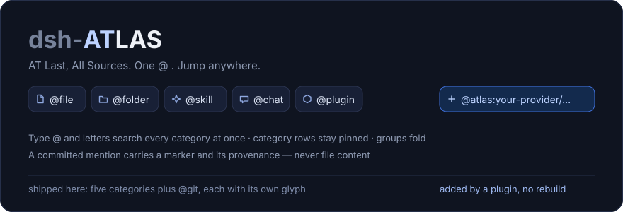
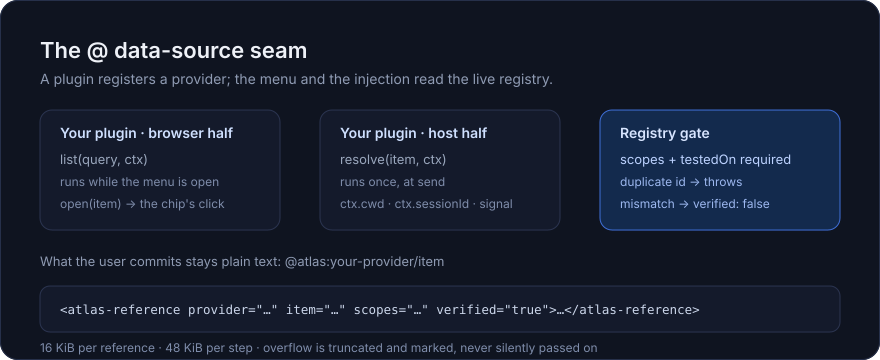
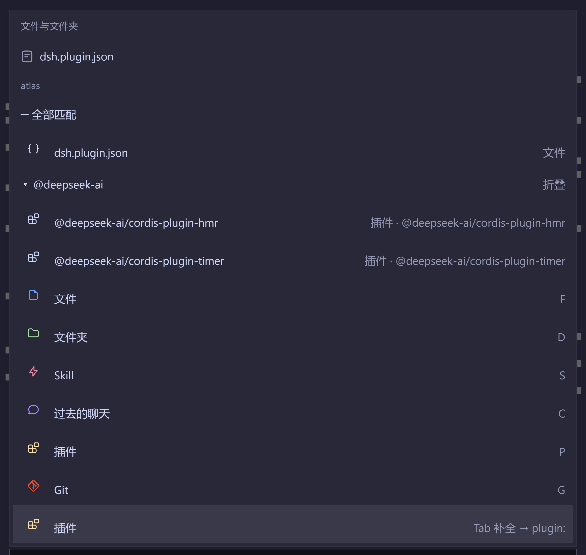
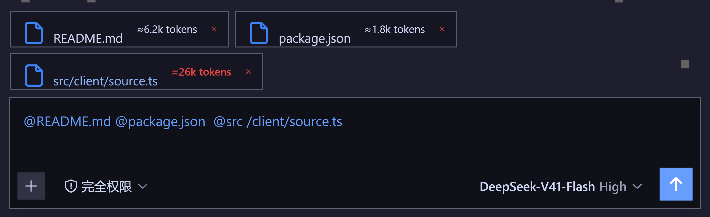
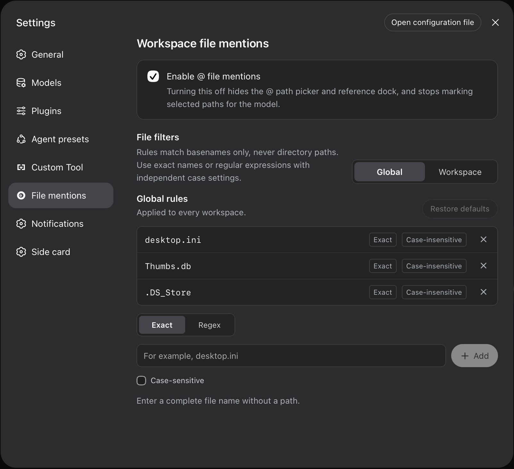

# dsh-ATLAS

[English](README.md) · **简体中文**

本项目属于 **Side Quest（支线任务）** 工作室（**Side Quest Labs**）—— npm 范围 `@sidequest-007/*`，仓库 [`jameswatt139240-crypto/dsh-ATLAS`](https://github.com/jameswatt139240-crypto/dsh-ATLAS)；**DSH 插件 id 沿用生态惯例的无 scope 形式 `dsh-*`**。



**AT Last, All Sources.**

**一 @ 即达。**

任何插件都能注册自己的类别，其余交给 Atlas；它画出的每个引用都是**可点的链接**（主题链接色，暗色下即蓝），**会话**链接点一下直接跳过去。

DeepSeek Harness Web 界面的**统一 `@` 提及**插件：在输入框输入 `@`，即可引用工作区**文件与文件夹**、可发现的 **Skill**、**过去的聊天记录**、**已安装插件**，以及**工作区的 git 改动** —— 而且任何其它插件都能把自己的类别加进同一个菜单。点一下**会话**引用，输入框就切到那个会话。

- **一个 `@`，所有来源**：五个内置类别 + 内置的 `@git` provider（本部署里共 **6 个资源族**）+ 所有已注册的数据源，同一个列表；输入字母即跨类别一起搜。
- **是平台，不是取词器**：第三方插件通过 `ctx.atlas` seam 注册自己的 `@` 类别。菜单每次打开都从**实时注册表**重建，所以**本包永远不需要为某个 provider 改代码** —— 见 [自己接一个 `@` 数据源](#自己接一个--数据源)。
- **只给来源，不给内容**：提交的引用只注入标记（`<workspace-reference>`、`<skill-reference>`、`<atlas-reference>` …）。插件只读目录项元数据；文件内容由 agent 在需要时自己去读。
- **治理写在代码里**：`scopes` 与 `testedOn` 必填、`id` 重复直接抛错、版本不匹配注册为 `verified: false`、provider 正文有预算（单条 16 KiB、单步 48 KiB）。
- **`@git` 既是范例，也是一个真实来源**：它像其它类别一样列出工作区的改动（路径 + 增删行数），并且完全按第三方的方式实现，两个半边加起来约 200 行。

<p align="center"></p>

它基于 [`dsh-at-file`](https://github.com/FSMargoo/dsh-at-file)（MIT）扩展而来：保留原有的工作区路径索引、文件过滤规则与粘贴保护，并新增四个类别、类别菜单与快捷键、混合结果、分组折叠，以及三个模型侧查询工具。

> `dsh-atlas` 与 `dsh-at-file` 都占用输入框的 `@` 触发位。请**二选一**，不要同时安装。

## 安装

前置：装好 DSH（`dsh` 在 `PATH` 上）并有一个 web profile。

```sh
# 从 GitHub 装（本仓库；lib/ 已随仓库提交，安装时不会触发构建）
dsh plugin --profile web add github:jameswatt139240-crypto/dsh-ATLAS

# 本地克隆（开发）
git clone https://github.com/jameswatt139240-crypto/dsh-ATLAS
dsh plugin --profile web add link:/path/to/dsh-ATLAS

# npm 包（发布后；scope 是工作室的，插件 id 仍是 `dsh-atlas`）
dsh plugin --profile web add @sidequest-007/dsh-atlas
```

安装或更新后**重启 `dsh web`**，确保 Host 与浏览器客户端都加载同一版本。然后在输入框打 `@`。

## 类别

输入 `@` 后，菜单顶部是五个常驻类别行；也可以直接输入关键字跨类别混合搜索。

| 类别 | 菜单前缀 | 快捷键 | 候选来源 | 选中后写入草稿 |
|---|---|---|---|---|
| 文件 | `file:` | `F` | 当前会话工作区索引 | `@src/index.ts` |
| 文件夹 | `folder:` | `D` | 同上 | `@src/client/` |
| Skill | `skill:` | `S` | `ctx.skills` 技能注册表 | `@skill:blender-modeling` |
| 过去的聊天 | `chat:` | `C` | 官方 session-reference 解析器 | `@[标题](dsh-session:<id>)` |
| 插件 | `plugin:` | `P` | 官方 plugin inventory | `@plugin:dsh-atlas` |

**单个快捷键字母是"意图"而不是"查询"**：输入它只显示类别行——五个内置类别 + 内置的 `@git`——以及一行「Tab 补全 → `类别:`」提示，且这行提示在**最下面**（高亮也已经落在它上面），按 <kbd>Tab</kbd> 或 <kbd>Enter</kbd> 即进入对应的 `类别:` 前缀。**注册的数据源也能有快捷键字母**：取 provider id 的首字母（`@git` → <kbd>G</kbd>），只有在该字母没被内置类别或更早注册的 provider 占用时才生效（`@<id>:` 前缀永远可用）。**过滤从更具体的东西开始**：不是快捷键的首字母，或第二个字符（`fi`/`fo`/`sk`/`ch`/`pl` 这类前缀本来就是两个字符）。点击类别行或「返回类别」行同样进入/返回，且**菜单保持打开**（这是本插件的两处覆写：正常 pick 路径会关闭菜单）。

**第六行起是"已注册数据源"。** `@git` 已内置（工作区的变更文件，引用内容就是该文件的 diff），任何插件都能用同样的方式加自己的类别——见[自己接一个 `@` 数据源](#自己接一个--数据源)。它们排在内置类别之后、按注册顺序出现，注册它们的插件被销毁时一起消失。插件自身的分组以**正的 `order`** 注册，因此它是菜单里的**最后一个分组**：底部那条工作带归本插件，框架自带 `dsh-client-ui-reference` 数据源的文件列表留在它上面。

## 交互

- **直接输入字母**：跨类别混合搜索，结果按「最近引用」与「全部匹配」两段展示，每行带类别标签；类别行（五个内置 + 内置的 `@git`）始终在**最下面的工作带**里可点选。
- **文件夹**：`@folder:` 类别列出目录，选中后写入 `@路径/`（末尾的 `/` 才是「目录」的标记，插件依然只读目录项元数据）；在斜杠后继续输入即可在该目录内收窄搜索。过滤时结果分**两档**排序：先按**名称**命中的文件夹（工作区内的在前，工作区外的在后），再是只有**路径**命中的那些，收进它们自己的 `路径匹配` 组。那一组默认展开、装得下就显示，折叠与否是你的手势。
- **先写的文件夹会成为后面文件列表的作用域**：`@e:/work/docs/ @file:` 会先列出**该文件夹自己的文件**（一层，走的是文件夹 tab 同一套目录列表），组标题写明它来自哪个文件夹、并标明在工作区之外，然后才是工作区里的命中项。作用域是**位置**决定的——当前 token 之前最近的那个文件夹引用——所以**不需要连接词**；草稿里没有文件夹引用时行为与以前完全一致。
- **分组折叠**：Skill 按管理层级（系统 / 用户 / 项目 / 自定义 / 插件）再按领域分组，插件按 npm scope（`@deepseek-ai/…` 或「其他」）分组，过去的聊天按工作区分组、子会话缩进在父会话下；组标题**点击即可折叠/展开；当高亮行正是该组标题时按 <kbd>Enter</kbd> 同样折叠/展开**。<kbd>Tab</kbd> 补全、<kbd>↑</kbd><kbd>↓</kbd>、<kbd>Esc</kbd> 全部由框架自己的 keymap 提供。除此之外插件只加三个键：高亮组标题上的 <kbd>Enter</kbd> 折叠、类别行/返回行选中后保持菜单打开、以及 <kbd>PageUp</kbd>/<kbd>PageDown</kbd> 按**实测一屏**翻页——翻页移动的是高亮（高亮属于别的数据源时就只滚列表），所以"看得见的那一行"永远是你正在操作的那一行。
- **列表长了就滚动，不再靠隐藏行数**：单个类别最多 `MAX_CANDIDATES`（20）行，装不下就由菜单滚动——<kbd>PageUp</kbd>/<kbd>PageDown</kbd> 一屏一屏走，且内容变化时（作用域目录列表后到、某组被折叠）插件会把焦点行重新拉回可视区。也就是说**不会为了菜单短一点而丢行**；谁排在前面由上面的分档决定。
- **相对时间**：历史会话与工作区行显示「刚刚 / 5分钟 / 3小时 / 2天」等相对时间。
- **初始视图**：`@file:` 先列出最近引用过的文件（最近的在前，按工作区持久化），其后按字母序。
- **引用成本与失效提示**：引用栏里的每个文件引用会显示约 token 成本（如 `≈1.2k tokens`；超过 8000 token 时高亮）；若引用的路径在工作区内已不存在，会标出「已失效」。成本取自文件大小（约 4 字节 / token），插件只读目录项元数据，**不读取文件内容**。
- **错字容错**：文件名的轻微拼写错误（如 `veiw` → `view.ts`、`clinet` → `client/…`）仍能命中。**精确匹配优先**——只要精确排序有结果，就不会混入模糊结果；长度小于 3 或含 `/` 的查询保持精确。
- **行范围引用**：直接手打 `@src/a.ts:12-40` 即可引用该文件的第 12–40 行（单行写 `@src/a.ts:7`；倒序 `40-12` 会自动归一为 `12-40`）。目录不接受行范围。Host 只校验语法与路径类型，**不会打开文件**，因此行号是否越界由 agent 读取时判断。
- **引用栏**：输入框上方按顺序显示当前草稿里的每个引用；文件、文件夹与 provider 行可点击打开，每行的 <kbd>×</kbd> 移除对应 token。
- **草稿里任何能打开的 `@路径` 都是链接**：判断依据是**插件自己**——token 能解码成引用、并且宿主确认该目标存在——而不是框架有没有把它装饰成引用。所以手打的 `@AGENTS.md` 和框架认出来的 token 一样：**整条**变蓝、点任意位置都打开、鼠标变手型。上色用 CSS Custom Highlight API 逐段绘制（Lexical 的文本 span 只允许一个文本子节点，包裹尾巴会破坏输入），颜色取框架给引用用的同一个变量。**目标已不存在**的 token 也不会被当成普通文本，而是按引用栏那套「已失效」语言画成**暗色 + 删除线**——它是引用，只是打不开。**判定时机**：只有**写完的 token** 才会被判失效（后面跟着空白，或后面还有下一行＝按过回车）；正在输入的 token 不下结论——`@N` 这种中间态必然"不存在"，边打边画删除线等于替用户还没写完的词下判决。**能打开**的 token 则在名字写成的那一刻就变蓝（与框架自己的引用装饰一样即时）。引用栏还没回答、provider 没声明 `open`、或名字放不下的 token 什么都不说、保持普通文本。浏览器不支持 highlight API 时什么都不绘制，此时**只有框架自己上过色的那部分**可点（没画成链接就不表现得像链接）。
- **草稿里由其它数据源插入的 chip 也能点**：右侧栏的文件树就是往草稿里插一条原子 chip，这个客户端把它画成框架自己的 chip 蓝、并且不接任何点击。点它即打开它命名的文件，随后 chip 会带上插件的链接语言。那个数据源给 chip 的标签是**文件名**（完整相对路径只存在于草稿文本里），所以裸文件名按两步还原：①在插件索引里找同名 basename，唯一命中即用；②索引里就有歧义（例如 `index.ts` 在工作区里有两处）时回退到**草稿**——草稿里只有一个同名 token 就用它，仍有两个则**保持不可点**。索引完全不认识的名字才原样交给点击时的存在性检查（结果是标「已失效」，而不是打开一个错的目标）。
- **已发送消息里的引用可点**：消息气泡里的引用 chip 点击即打开（文件进右侧栏，无右栏时交宿主打开器；Skill 交给 Skill 源；provider item 交给它自己声明的 `open`）。只有真的能打开的 chip 会被画成链接（用框架自己的 `--dsw-alias-link` 蓝 + 悬停下划线），框架自己接好点击的版本会渲染 `<button>`，本插件自动让位。插件同时实现了框架的 `openReference` 钩子：客户端在草稿里激活一个引用 token 时，由拥有它的 source 打开。安装版客户端还没有接上这一步，因此这个点击同样由插件补上，走的是 chip 用的那同一个动作。
- **会话引用本身就是链接**：它画出的每个引用都是**可点的链接**（用主题的链接色，暗色下即蓝 + 悬停虚下划线），身份按**值**判定，因为 id 不在路径里。`@[标签](dsh-session:…)` 这种带载荷的形态自己就能指明会话（载荷按 base64url 解码并要求**规范化回环**通过）；**标签里有空格也算一个 token**；手打的裸 `@<会话id或标题>` 只有**唯一命中**会话列表时才提升为会话链接——歧义或查不到就保持普通文本，所以 `@AGENTS.md` 仍然是它本来那个文件引用。点击即切换当前会话，走的是**侧栏那一行的同一个动作**。**边界**：**已发送**的消息只有在 chip 上还留着载荷时才可点；一旦 Host 把它折成裸标签，id 就不在了——这条我已按上游通道提了报告。
- **图标**：本插件发出的每一行都带**自己的**图标——与引用栏同一套现代线稿，含按文件类型与语言的标记（TypeScript、Rust、PDF、图片、压缩包…），`@git` 用分支图标。框架的菜单行只会画它自己的三种字形，所以插件**预定那个图标槽**（这决定了所有名字缩进一致），再由自己在列表上方的一层固定层里、用单色线条画出图标：不往框架拥有的行里插任何东西，框架自己的字形也只在被这一层真正覆盖的槽里隐藏。



*菜单（滚到最底部的工作带）：上面是带类别标签的混合结果列表——文件行带所在目录、还有折叠的插件分组——最下面是五个类别加 `@git`，每行都是插件自己画的图标。工作带是最后一组、离输入框最近；本插件的分组用正序注册，所以框架自带的数据源仍在它上方。*



*输入框上方的引用栏：草稿里每个引用一行，各带自己的图标、≈token 成本（红色的 `≈26k tokens` 是超过 8 000 的高亮）与移除按钮——草稿里的每个 token 同时都被画成链接。*

## 注入语义

每次 agent 开始处理前，插件会校验草稿中的每个引用，并追加一条**只含引用信息、不含文件内容**的消息。文件内容始终由 agent 使用当前会话的工具按需读取。

```text
看下 @docs/spec.pdf
用 @skill:blender-modeling
回忆 @[付款费率](dsh-session:xxx)
配合 @plugin:dsh-atlas
取出 @atlas:git/src/extract.ts 的 diff
```

| 类别 | 注入的标记 | 消息来源 |
|---|---|---|
| 文件 / 文件夹 | `<workspace-reference path="docs/spec.pdf" kind="file" />`（带行范围时追加 `lines="12-40"`） | `at-file-mention` |
| Skill | `<skill-reference name="blender-modeling" />` | `atlas-skill` |
| 插件 | `<plugin-reference name="dsh-atlas" />` | `atlas-plugin` |
| 过去的聊天 | 官方 `session-reference` 只读快照（可回放、带预算） | `session-reference` |
| 已注册的 `@` 数据源 | `<atlas-reference provider="git" item="src/a.ts" scopes="process:git" verified="true">…</atlas-reference>` | `atlas-provider` |

- 引用目录时**只注入该目录**，不展开其中的内容；需要时由 agent 自行列出。
- 绝对路径与越出工作区的路径会被忽略。
- 引用的文件必须仍然存在；不存在或越界的 token 不会产生标记。
- Skill 正文默认不注入（见 `injectSkillBody`），由 agent 的技能工具按需加载。
- 历史会话快照由官方实现负责预算与上限（单源 64 KB、最多 3 个、拒绝自引用）。
- `@atlas:` 是唯一带正文的标记。正文完全来自 provider 自己的回答，不是本插件打开的任何文件：单条上限 16 KiB、单步合计 48 KiB，超长部分被截断并标记 `truncated="true"`。

## 自己接一个 `@` 数据源

菜单是这个 seam 唯一的消费方。它每次打开都从实时注册表重建类别行，所以插件只要注册一条声明就多出一个 `@` 类别——本包里没有任何 provider 清单，也不需要重新构建它。

```ts
// Host 半边：已提交的引用最终变成什么。`ctx.get('atlas')` 就是 seam。
import type { AtlasProvider, AtlasSeam } from '@sidequest-007/dsh-atlas'

const provider: AtlasProvider = {
  id: 'diag',                  // 草稿里就是 @atlas:diag/…
  display: 'Diagnostics',
  scopes: ['process:lsp'],     // 你会碰什么（必填）
  testedOn: ['0.1.5-rc.1'],    // 你真正跑过的 DSH 版本（必填）
  async resolve(item, context) {
    // context.cwd 是被回答会话的工作区；context.sessionId 是它的身份。
    return await diagnosticsFor(context.cwd, item.id, context.signal)
  },
}

const atlas = ctx.get('atlas') as AtlasSeam
atlas.register(provider)       // 返回一个 disposer
```

```ts
// 浏览器半边：菜单打开时的候选，来自你自己的客户端 bundle。
const provider: AtlasProvider = {
  id: 'diag',
  display: 'Diagnostics',
  scopes: ['process:lsp'],
  testedOn: ['0.1.5-rc.1'],
  async list(query, context) {
    return await askYourHost(query, context.sessionId, context.signal)  // 必须便宜
  },
  open(item, context) {
    // 可选：用户在**已发送**的消息里点 `@atlas:diag/…` 时做什么。
    // 你的 item 是什么意思只有你知道（文件路径？URL？记录 id？），
    // 所以菜单永远不会替你解释它——没写 open，那颗 chip 保持不可点。
    openInYourViewer(item)
  },
}
```

一个 provider 可以只注册其中半边，也可以两半都注册，`id` 把两半绑在一起。用户提交进草稿的是纯文本（`@atlas:diag/src/a.ts:12`），所以 provider 的内容永远不会进入草稿；模型看到什么，只由 Host 半边的 `resolve` 决定。

| 规则 | 原因 |
|---|---|
| 注册**就是**授权 | 没注册的插件在这里不可见：不扫描、不猜测、不发现 |
| `list` 在菜单打开期间跑 | 它决定手感；不便宜就自己缓存 |
| `resolve` 每次发送只跑一次 | 可以贵，并且会拿到会话的 `cwd` 与 `AbortSignal` |
| `open` 可选，且只属于菜单半边 | 点的动作发生在浏览器里；没声明 `open` 的 provider，chip 不可点（也不会画成可点） |
| `scopes` 与 `testedOn` 必填 | 缺少任一项，`register()` 直接拒绝 |
| `testedOn` 按相等比较 | 不匹配则以 `verified: false` 注册；运行版本未知时**永远**不算已验证 |
| `id` 唯一 | 重复会抛错并指名先注册者，不静默覆盖 |
| 正文由 seam 统一限量 | 单条 16 KiB、单步 48 KiB；超出部分被标记，不会被放行 |
| 空正文不注入任何东西 | provider 说"没什么可加"就不该花 token |

版本裁决在每次读注册表时重新判定，所以"比浏览器拿到运行版本更早注册"的 provider 不会永久停留在未验证。

### 三类不接

三条全中才接，否则不接：

| 不接 | 理由 |
|---|---|
| **模型自己能拿到的** | `@file` / `@session` 官方已内置；同一份数据的第二条路只是噪音 |
| **不可窄选的** | 全量 logcat 或整个数据库 dump 会污染上下文；引用必须是一次选择 |
| **`resolve` 贵的** | 懒加载是契约，不是偏好 |

判定标准：**可窄选 · 可预览 · 注入即有用。**

`@git` 就是照这个标准写出来的范例，且完全按第三方的方式实现：`src/git.ts`（Host：读变更列表、产出单个文件的 diff，全程不打开任何文件）与 `src/client/git-provider.ts`（浏览器：通过 `atlas/gitChanges` 向 Host 要数据，逐键筛选、限量）。

## 模型侧工具

除了发送时注入的标记，模型还可以在需要时主动查询这些类别：

| 工具 | 用途 |
|---|---|
| `past_chats` | 按标题或工作区列出历史会话，用于 `@过去的聊天` 之后的追问 |
| `read_past_chat` | 读取某个已引用会话的当前用户/助手消息面 |
| `plugin_info` | 列出已安装插件及其启用状态，可按模块名过滤 |

## 设置

在 **设置 → 工作区文件提及** 中管理：

| 设置项 | 默认 | 说明 |
|---|---|---|
| 启用 @ 文件提及 | 开 | 总开关；关闭后隐藏 `@` 菜单与引用栏，并停止注入标记 |
| 启用 @Skill 提及 | 开 | 是否在菜单中显示 Skill |
| 启用 @过去的聊天 提及 | 开 | 是否在菜单中显示历史会话 |
| 启用 @插件 提及 | 开 | 是否在菜单中显示已安装插件 |
| 候选数量上限 | 50 | 每次请求返回的候选条目上限（1–200） |
| 忽略粘贴文本中的 @ | 开 | 从其他应用粘贴的 `@内容` 保持普通文本，不触发引用 |
| 文件过滤 | — | 全局与工作区两套规则；每条可选 Exact / Regex 与是否区分大小写 |



文件过滤只匹配**文件名**（不含目录路径）。工作区规则与全局规则同时生效；修改规则会清除索引缓存，下一次输入 `@` 即生效。

## 配置

以下参数在所选 profile 的 `cordis.patch.yml` 中配置（常用路径 `~/.dsh/profiles/web/cordis.patch.yml`）：

```yaml
- id: dsh-atlas
  config:
    maxIndexedFiles: 2000   # 工作区索引条目上限
    ignoreDirs: []          # 替换内置忽略目录列表；留空数组表示索引所有目录
    injectSkillBody: false  # 引用 Skill 时是否连同正文一起注入
```

`ignoreDirs` 省略时使用内置列表（版本控制目录、IDE 元数据、依赖目录、缓存与构建产物等）。

## 设计约束

- **只传路径，不读内容**：Host 端只校验并注入路径、类别与来源标记，从不打开引用的文件，也从不列出目录内容。
- **粘贴保护**：外部文本无法伪造引用——只有 `source.kind === 'user'` 的消息才会被扫描，且粘贴内容默认被标记为普通文本。
- **工作区边界**：引用被限制在当前会话的工作区内；绝对路径与 `..` 逃逸会被拒绝。
- **模型可见即可回放**：注入的标记都带来源，随会话日志持久化。
- **展示位不参与匹配**：`@` 菜单旁的展示位与候选计算完全解耦，不会阻塞或影响搜索；它不读取任何会话数据。

## 开发

**前置条件**：devDependencies 是指向 DSH **源码检出**的 `link:` 条目，默认期望在本仓库同级目录 `../deepseek-harness`。没有它 `pnpm install` 无法解析依赖，因此**单纯 clone 本仓库不能直接构建**（这些包在 npm 上也有，例如 `@deepseek-ai/dsh-client-ui-conversation@0.1.6-alpha.1`；这里刻意指向检出，是为了让插件始终对着与 Harness 构建同源的代码做测试）。

```sh
git clone https://github.com/jameswatt139240-crypto/dsh-ATLAS
git clone <DSH 源码检出> ../deepseek-harness   # 或者改 package.json 里的 link 指向你的路径
cd dsh-ATLAS
pnpm install
pnpm run check           # typecheck + 测试 + 无广告构建 + 发布面门禁
pnpm run build           # 仅构建（默认不含广告面板）
pnpm run build:ads       # 构建含广告面板的版本（不用于首次发布）
pnpm run verify:publish  # 单独运行发布面门禁
```

`lib/` 中的构建产物会提交到仓库，因此从 profile 安装时不需要执行构建脚本。改动需要过的检查见 [CONTRIBUTING.md](CONTRIBUTING.md)。

### 发布

- **默认构建不含广告**：`pnpm run build` 会把广告面板与横幅图片一并替换为桩，因此
  `lib/client.js` 里既没有广告代码也没有图片字节（无广告约 726 KB，含广告约 978 KB）。
  后续要出带广告的版本，使用 `pnpm run build:ads`。
- **发布面门禁**在 `npm publish` 前自动运行（`prepublishOnly`），拒绝以下内容进入 npm 包：
  内部计划目录（既不进 git 也不进 tarball）、AI 助手说明文件（`AGENTS.md`、`CLAUDE.md`、`.agents/`、`.claude/`、
  `.cursor/`、`skills/`）、TypeScript 源码与测试、sourcemap（内联源码与本机路径）、
  仍然内联广告图的构建产物、泄漏本机路径的产物，以及**四处包名不一致**
  （`package.json`、`dsh.plugin.json`、`cordis.patch.yml`、客户端 bundle id，外加 invariant 伴生包）。
  确需发布广告版本时设置 `DSH_ATLAS_ALLOW_ADS=1`。
- **发版**：tag 就是发布决定。

  ```sh
  pnpm run check                                  # 完整梯子，需要 ../deepseek-harness
  git tag -a v1.0.0 -m "dsh-ATLAS 1.0.0"
  git push origin main --tags                     # release workflow 自动发布
  ```

  `.github/workflows/publish-surface.yml` 在每次 push 上跑**自足**门禁（不需要 registry、也不需要 DSH 检出，
  它只是把已提交的 `lib/` 打成 tarball 再检查）；`.github/workflows/release.yml` 在 `v*` tag 上用
  **可信发布（OIDC / Trusted Publishing）**：**既不要 `NPM_TOKEN` 也不要 OTP** —— GitHub 用
  `permissions: id-token: write` 签发一次性身份，npm 按该包配置的 trusted publisher 校验后授权发布。
  这项配置是一次性的，位置在 `https://www.npmjs.com/package/@sidequest-007/dsh-atlas/access` →
  *Trusted Publisher*（user `jameswatt139240-crypto`、repository `dsh-ATLAS`、workflow 文件名 `release.yml`、
  勾选"允许直接 publish"），而且**只能在包已存在之后添加** —— trusted publisher 是挂在包上的，所以 1.0.0 本身
  是交互式发布的。该 job 还会在"该版本已在 npm 上"时自动跳过，并以 `--ignore-scripts` 发布（完整梯子依赖
  DSH 源码检出，CI 里没有）。若要手动发布：`npm publish --registry https://registry.npmjs.org`
  （镜像如 `registry.npmmirror.com` 不能接收发布）。

## 兼容性

插件同时兼容两代 Harness 的 Typert codec 校验（安装版校验 `codec.schema.parse`，源码检出校验 `codec.create()`），并在运行时通过 `ctx.remote.session.openWorkspacePath` 打开引用路径。

## License

**MIT**（见 [LICENSE](LICENSE)）——随便用、改、发、卖，只要在你分发出去的副本里保留版权声明。它也是 OSI 认可的开源许可，要求开源许可的插件市场不会卡它。

本项目是 [`dsh-at-file`](https://github.com/FSMargoo/dsh-at-file)（MIT）的衍生作品：上游的版权声明与许可原文保留在 [LICENSE-ORIGINAL](LICENSE-ORIGINAL)，哪些文件来自上游见 [NOTICE](NOTICE)。
